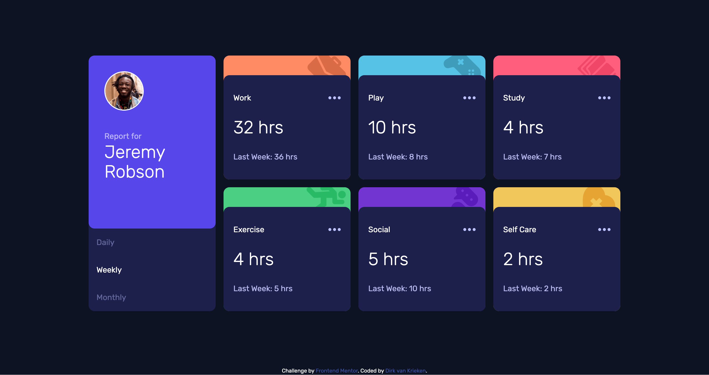

# Time tracking dashboard solution

This is a solution to the [Time tracking dashboard challenge on Frontend Mentor](https://www.frontendmentor.io/challenges/time-tracking-dashboard-UIQ7167Jw).

## Table of contents

- [Overview](#overview)
  - [The challenge](#the-challenge)
  - [Screenshot](#screenshot)
  - [Links](#links)
- [My process](#my-process)
  - [Built with](#built-with)
  - [What I learned](#what-i-learned)
  - [Continued development](#continued-development)
- [Author](#author)

## Overview

### The challenge

Users should be able to:

- View the optimal layout for the site depending on their device's screen size
- See hover states for all interactive elements on the page
- Switch between viewing Daily, Weekly, and Monthly stats

### Screenshot

### Links

- Solution URL: [https://github.com/dirkvankrieken/Time-Tracking-Dashboard](https://github.com/dirkvankrieken/Time-Tracking-Dashboard)
- Live Site URL: [https://dirkvankrieken.github.io/Time-Tracking-Dashboard/](https://dirkvankrieken.github.io/Time-Tracking-Dashboard/)

## My process

### Built with

- HTML
- CSS Grid
- Mobile-first workflow
- [Vite](https://vite.dev/) Javascript Build Tool
- [TailwindCSS](https://tailwindcss.com/) CSS Framework

**Note: These are just examples. Delete this note and replace the list above with your own choices**

### What I learned

- I learned to use TailwindCSS to apply all of the needed CSS styles, such as the grid layout, positioning, colors, images.
- I learned to use Vite Javascript Framework for developing (mainly because I wanted to use tailwindcss)
- I learned to deploy the page as a Vite-app to Github Pages
- I learned to use a .json file for data and the javascript fetch api to fetch data from a json file
- Improved problem solving capabilities by using Google and ChatGPT

<!-- ### Continued development -->

<!--
Use this section to outline areas that you want to continue focusing on in future projects. These could be concepts you're still not completely comfortable with or techniques you found useful that you want to refine and perfect.

**Note: Delete this note and the content within this section and replace with your own plans for continued development.** -->

### Author

[linkedin.com/in/dirk-van-krieken](https://www.linkedin.com/in/dirk-van-krieken/)
[github.com/dirkvankrieken](https://github.com/dirkvankrieken/)
